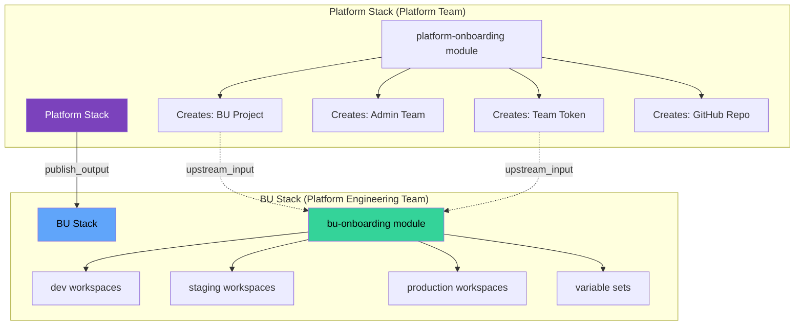

# BU Onboarding Module

Terraform module for **business unit teams** to manage their own HCP Terraform workspaces within projects provisioned by the platform team.

## Overview

This module enables **self-service workspace management** for business unit teams:

- ✅ **Workspace Management** - Create and configure HCP Terraform workspaces
- ✅ **VCS Integration** - Connect workspaces to GitHub repositories  
- ✅ **Variable Configuration** - Workspace-specific Terraform and environment variables
- ✅ **Variable Sets** - Shared configuration across multiple workspaces
- ✅ **Agent Support** - Configure agent pools for private infrastructure
- ✅ **Environment Isolation** - Dev/staging/production workspace separation
- ✅ **Auto-tagging** - Automatic environment and business unit tags

**Perfect for IT teams**: Platform Engineering, Security Operations, Cloud Infrastructure, and any team managing their own infrastructure.

## Architecture

This module is designed for the **downstream BU Stack** in the linked stacks pattern:



### How It Works

1. **Platform Stack** creates control project, admin team, and seeds BU Stack repository
2. **BU Stack** receives project ID and admin token via `upstream_input`
3. **bu-onboarding module** creates workspaces within the BU's project
4. **YAML configuration** defines workspaces for different environments (dev/staging/prod)
5. **Teams manage** their own infrastructure through their workspaces

### Linked Stacks Pattern

```
┌─────────────────────────────────────────────────────────────┐
│ Platform Stack (Platform_Team project)                      │
│                                                              │
│  Component: platform-onboarding                             │
│  Publishes: bu_project_id, bu_admin_token                   │
└─────────────────────────────────────────────────────────────┘
                              ↓
                    (publish_output → upstream_input)
                              ↓
┌─────────────────────────────────────────────────────────────┐
│ BU Stack (tfc-platform-engineering-bu-stack repo)           │
│  Runs in: BU_platform-engineering project                   │
│                                                              │
│  Component: bu-onboarding (this module)                     │
│  ├─ Upstream: bu_project_id, bu_admin_token                 │
│  ├─ Reads: YAML workspace configuration                     │
│  └─ Creates: Workspaces + Variable Sets                     │
│                                                              │
│  Deployments:                                               │
│    ├─ dev       → k8s-dev, mesh-dev workspaces              │
│    ├─ staging   → k8s-staging workspaces                    │
│    └─ production → k8s-prod, mesh-prod workspaces           │
└─────────────────────────────────────────────────────────────┘
```

## Requirements

| Name | Version |
|------|---------|
| terraform | >= 1.13.5 |
| tfe | ~> 0.60 |

**IMPORTANT**: This module does NOT include provider blocks. When using with Terraform Stacks, configure providers in your Stack's `providers.tfcomponent.hcl` file.

## Usage

### Complete Example (Terraform Stacks)

**In your BU Stack's `deployments.tfdeploy.hcl`:**

```hcl
# Receive upstream inputs from platform stack
upstream_input "platform_stack" {
  type   = "stack"
  source = "app.terraform.io/cloudbrokeraz/platform-team/platform-stack"
}

# Embed YAML configuration content
locals {
  dev_yaml = <<-EOT
    business_unit: platform-engineering

    workspaces:
      - workspace_name: k8s-dev-us-east-1
        workspace_description: Kubernetes cluster - development
        execution_mode: remote
        workspace_terraform_version: "1.13.5"
        workspace_auto_apply: true
        workspace_tags:
          - kubernetes
          - development
        vcs_repo:
          identifier: hashi-demo-lab/kubernetes-platform
          branch: develop
        variables:
          environment:
            value: development
          cluster_version:
            value: "1.28"
          node_count:
            value: "3"
          enable_monitoring:
            value: "true"
            hcl: true
  EOT
}

# Deployment for development environment
deployment "dev" {
  inputs = {
    tfc_organization_name = "cloudbrokeraz"
    
    # Upstream inputs from platform stack
    bu_project_id = upstream_input.platform_stack.bu_project_ids_map["platform-engineering"]
    
    # Business unit and environment
    business_unit = "platform-engineering"
    environment   = "dev"
    
    # YAML configuration content
    yaml_config_content = local.dev_yaml
    
    # VCS OAuth token
    vcs_oauth_token_id = var.vcs_oauth_token_id
    
    # Feature flags
    enable_assessments = true
    queue_all_runs     = false
  }
}
```

**In your BU Stack's `components.tfcomponent.hcl`:**

```hcl
component "bu_onboarding" {
  source  = "app.terraform.io/cloudbrokeraz/bu-onboarding/tfe"
  version = "main"  # or specific version tag
  
  inputs = {
    # Organization and project
    tfc_organization_name = var.tfc_organization_name
    bu_project_id         = var.bu_project_id
    
    # Configuration
    yaml_config_content = var.yaml_config_content
    business_unit       = var.business_unit
    environment         = var.environment
    
    # VCS integration
    vcs_oauth_token_id = var.vcs_oauth_token_id
    
    # Feature flags
    enable_assessments          = var.enable_assessments
    queue_all_runs              = var.queue_all_runs
    enable_remote_state_sharing = var.enable_remote_state_sharing
  }
  
  providers = {
    tfe = provider.tfe.this
  }
}
```

### YAML Configuration Example

The `yaml_config_content` variable accepts YAML with this structure:

```yaml
business_unit: platform-engineering

workspaces:
  - workspace_name: k8s-prod-us-east-1
    workspace_description: Production Kubernetes cluster
    execution_mode: remote
    workspace_terraform_version: "1.13.5"
    workspace_auto_apply: false
    workspace_vcs_directory: terraform/kubernetes
    workspace_tags:
      - kubernetes
      - production
      - critical
    
    vcs_repo:
      identifier: hashi-demo-lab/kubernetes-platform
      branch: main
    
    variables:
      environment:
        value: production
        description: Deployment environment
        category: terraform
      
      aws_region:
        value: us-east-1
        description: AWS region
      
      cluster_version:
        value: "1.28"
        description: Kubernetes version
      
      node_count:
        value: "10"
        description: Number of worker nodes
      
      enable_monitoring:
        value: "true"
        hcl: true
        description: Enable cluster monitoring
      
      node_instance_types:
        value: '["t3.xlarge", "t3.2xlarge"]'
        hcl: true
        description: Allowed EC2 instance types

  - workspace_name: service-mesh-prod
    workspace_description: Production Istio service mesh
    execution_mode: remote
    workspace_terraform_version: "1.13.5"
    workspace_auto_apply: false
    workspace_tags:
      - service-mesh
      - production
    
    vcs_repo:
      identifier: hashi-demo-lab/service-mesh
      branch: main
    
    variables:
      environment:
        value: production
      mesh_type:
        value: istio
      enable_tracing:
        value: "true"
        hcl: true
      enable_mtls:
        value: "true"
        hcl: true
```

**Key Fields:**

**Workspace Configuration:**
- `workspace_name` (required): Unique workspace identifier
- `workspace_description` (required): Human-readable description
- `workspace_terraform_version`: Terraform version (default: latest)
- `workspace_auto_apply`: Auto-apply runs (default: false)
- `workspace_vcs_directory`: Working directory in repo
- `workspace_tags`: List of tags (auto-tags added: environment, business_unit)
- `execution_mode`: `remote` or `agent` (default: remote)

**VCS Repository:**
- `vcs_repo.identifier`: Repository (e.g., `org/repo`)
- `vcs_repo.branch`: Branch name (default: `main`)

**Variables:**
- `value`: Variable value (as string)
- `description`: Human-readable description (optional)
- `category`: `terraform` or `env` (default: `terraform`)
- `hcl`: Treat value as HCL expression (default: `false`)
- `sensitive`: Mark as sensitive (default: `false`)

**Note**: In Terraform Stacks, you cannot use `file()` in `.tfdeploy.hcl` files. Embed YAML content using heredoc strings (`<<-EOT ... EOT`) in the `locals` block.

## Providers

Providers are **NOT** configured in this module. Configure them in your Terraform Stack:

```hcl
# In your BU Stack's providers.tfcomponent.hcl

required_providers {
  tfe = {
    source  = "hashicorp/tfe"
    version = "~> 0.60"
  }
}

provider "tfe" "this" {
  config {
    hostname = "app.terraform.io"
    token    = var.bu_admin_token  # From upstream_input
  }
}
```

## Inputs

| Name | Description | Type | Default | Required |
|------|-------------|------|---------|:--------:|
| tfc_organization_name | HCP Terraform organization name | `string` | n/a | yes |
| bu_project_id | Business unit control project ID from platform stack | `string` | n/a | yes |
| yaml_config_content | YAML configuration content as string | `string` | n/a | yes |
| vcs_oauth_token_id | OAuth token ID for VCS connection | `string` | n/a | yes |
| business_unit | Business unit name (optional filter) | `string` | `null` | no |
| environment | Environment name (dev/staging/production) | `string` | `"dev"` | no |
| enable_assessments | Enable drift detection assessments | `bool` | `false` | no |
| queue_all_runs | Queue all runs on workspace creation | `bool` | `false` | no |
| enable_remote_state_sharing | Enable remote state sharing | `bool` | `false` | no |

## Outputs

### Summary
| Name | Description |
|------|-------------|
| deployment_summary | Resource creation summary (counts, BU, environment) |

### Workspaces
| Name | Description |
|------|-------------|
| workspace_ids_map | Map of workspace names to IDs |
| workspace_names | List of workspace names created |
| workspace_urls | Map of workspace names to HCP Terraform URLs |
| workspace_details | Complete workspace resource details |

### Variable Sets
| Name | Description |
|------|-------------|
| variable_set_ids_map | Map of variable set names to IDs |
| variable_set_names | List of variable set names |
| variable_set_workspace_associations | Variable set to workspace associations |

### Debugging
| Name | Description |
|------|-------------|
| workspace_configuration | Parsed YAML configuration (for debugging) |
| workspaces_with_vcs | List of workspaces with VCS configured |
| workspaces_with_agents | List of workspaces using agent execution |
| workspaces_with_auto_apply | List of workspaces with auto-apply enabled |

## Multi-Environment Pattern

Typical pattern for dev/staging/production:

```hcl
# In deployments.tfdeploy.hcl

locals {
  dev_yaml = <<-EOT
    business_unit: platform-engineering
    workspaces:
      - workspace_name: k8s-dev
        # ... dev configuration
  EOT
  
  staging_yaml = <<-EOT
    business_unit: platform-engineering
    workspaces:
      - workspace_name: k8s-staging
        # ... staging configuration
  EOT
  
  prod_yaml = <<-EOT
    business_unit: platform-engineering
    workspaces:
      - workspace_name: k8s-prod
        # ... production configuration
  EOT
}

deployment "dev" {
  inputs = {
    environment         = "dev"
    yaml_config_content = local.dev_yaml
    # ...
  }
}

deployment "staging" {
  inputs = {
    environment         = "staging"
    yaml_config_content = local.staging_yaml
    # ...
  }
}

deployment "production" {
  inputs = {
    environment         = "production"
    yaml_config_content = local.prod_yaml
    # ...
  }
}
```

## Workspace Naming Conventions

Choose consistent naming patterns:

**By Environment:**
- `app-dev`, `app-staging`, `app-prod`
- `k8s-dev-us-east-1`, `k8s-prod-us-west-2`

**By Service:**
- `kubernetes-platform-prod`
- `service-mesh-staging`
- `api-gateway-dev`

**By Region:**
- `infrastructure-us-east-1`
- `infrastructure-eu-west-1`

The module automatically adds tags:
- `environment:{environment}` (from `var.environment`)
- `business_unit:{bu_name}` (from YAML `business_unit`)

## Module Dependencies

### YAML Configuration Content
Pass YAML configuration as a string via `yaml_config_content` variable. In Terraform Stacks:

**❌ Don't do this** (file() not available in .tfdeploy.hcl):
```hcl
deployment "dev" {
  inputs = {
    yaml_config_content = file("./config/dev.yaml")  # Error!
  }
}
```

**✅ Do this instead** (embed as heredoc string):
```hcl
locals {
  dev_yaml = <<-EOT
    business_unit: platform-engineering
    workspaces:
      - workspace_name: k8s-dev
        workspace_description: Development cluster
  EOT
}

deployment "dev" {
  inputs = {
    yaml_config_content = local.dev_yaml  # Works!
  }
}
```

### VCS OAuth Token
Required for connecting workspaces to GitHub repositories:
- Create OAuth client in HCP Terraform: Settings → Version Control → Add VCS Provider
- Note the OAuth Token ID (format: `ot-xxxxxxxxxxxx`)
- Pass in deployment inputs

### Upstream Inputs
Receive from platform stack:
- `bu_project_id` - Project where workspaces are created
- `bu_admin_token` - Team token for authentication (optional, can use Stack execution context)

### HCP Terraform Permissions
The BU admin team token (or Stack execution context) requires:
- **Project**: Manage workspaces
- **Organization**: Read/write variable sets
- **Workspaces**: Create and configure

## Troubleshooting

### "This object does not have an attribute named 'workspace_name'"
**Cause**: YAML structure incorrect (using `name:` instead of `workspace_name:`)  
**Fix**: Ensure YAML uses correct field names with `workspace_` prefix

### "Call to unknown function 'file'"
**Cause**: Trying to use `file()` in `.tfdeploy.hcl`  
**Fix**: Embed YAML content as heredoc string in `locals` block (see examples above)

### "Invalid OAuth token ID"
**Cause**: OAuth token ID format incorrect or doesn't exist  
**Fix**: Verify format is `ot-xxxxxxxxxxxx` and token exists in organization

### "Project not found"
**Cause**: `bu_project_id` incorrect or upstream input not configured  
**Fix**: Verify `upstream_input` block references correct platform stack deployment

### "Workspace already exists"
**Cause**: Workspace with same name already exists in organization  
**Fix**: Choose unique workspace names or delete existing workspace

### "VCS repository not accessible"
**Cause**: Repository doesn't exist or OAuth token lacks permissions  
**Fix**: Verify repository path and OAuth client has access to organization/repos

## Examples

See `examples/` directory for:
- **basic/** - Minimal workspace configuration
- **complete/** - Full-featured example with multiple workspaces and variable sets

## Related Resources

- **platform-onboarding Module**: Upstream module that creates BU projects
- **Platform Stack**: Stack using platform-onboarding module
- **HashiCorp Terraform Stacks**: https://developer.hashicorp.com/terraform/language/stacks

## License

MIT License

## Support

Contact your platform team or see the main platform stack repository for support.

---

**Module Version**: 1.0.0  
**Terraform Stacks**: v1.13.5+  
**Last Updated**: November 2024

